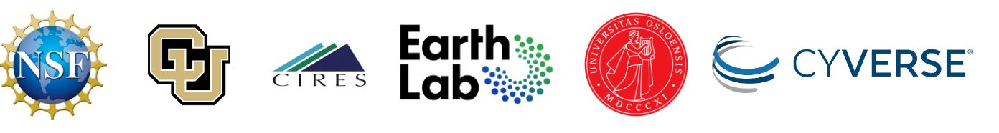
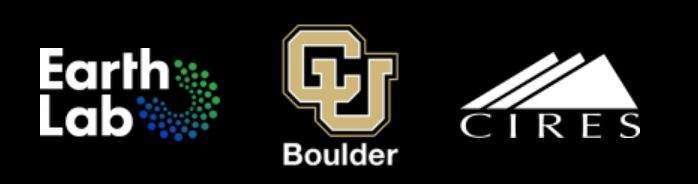
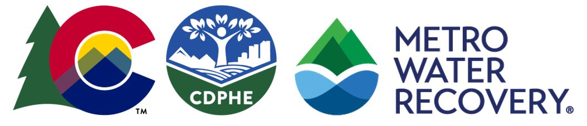

### Hello! My name is Michela, nice to meet you! 

## Contact info:

<ul> 
<li> Name: Michela Johnson </li>
<li> Email: michelaj1188@outlook.com 📩</li>
<li> Phone: (720)-551-2030 ☎ </li>
<li> LinkedIn: linkedin.com/in/michela-johnson-363545217 📸 </li>
<li> School: University of Colorado Boulder, Spring 2024 Grad 🐃 </li>
<li> Degree: Bachelors of Science in Environmental Engineering </li>
</ul>

## Projects:
<ul> 
<li> Water Quantity, Quality, and Accessibility on the Dine (Navajo) Reservation (CIRES/ESIIL)
  <ul> 
    <li> Presentation: https://www.youtube.com/watchv=I8ltH6REyzo&ab_channel=EarthLabCUBoulder </li> 
      
    </ul>

<li> Predicting Streamflow Data from Snowpack: An Exploration (CIRES/EDSC) 
 <ul>
    <li> Presentation:https://www.youtube.com/watch?v=w3hB6zGFr-Q&ab_channel=EarthLabCUBoulder </li>
  <li> Blog: https://earthlab.colorado.edu/blog/predicting-streamflow-data-snowpack-exploration </li>
      
         </ul>

<li> Metro Waste Water Pollution Mitigation (Colorado Department of Public Health and Environment) 
   <ul> 
    <li> LINK </li>
       
</ul>
</ul>

## Publications & Appearances:
<ul> 
<li> Fostering the Development of Earth Data Science Skills in a Diverse Community of Online Learners: A Case Study of the Earth Data Science Corps (CIRES) </li>
  <ul> 
    <li> Quarderer, N. A., Wasser, L., Gold, A. U., Montaño, P., Herwehe, L., Halama, K., Johnson, M., ..., Balch, J. (2024). Fostering the Development of Earth Data Science Skills in a Diverse Community of Online Learners: A Case Study of the Earth Data Science Corps. Journal of Statistics and Data Science Education, 1–13. <li>
      https://doi.org/10.1080/26939169.2024.2362886 
    <li> PIC? <li>
  </ul>
<li> Water Quantity, Quality, and Accessibility on the Dine (Navajo) Reservation (CIRES/ESIIL) </li>
  <ul> 
    <li> Sheldon, S., Leedle, C., Patrick, R., Smedes, M., Johnson, M., Jacquez, N., Rohlehr, K., Brady, S., & Parr, D. (2024, May 16). Water Quantity, Quality, and Accessibility on the Diné (Navajo) Reservation. Figshare.com. <li>
      https://doi.org/10.6084/m9.figshare.25843900.v1 
  </ul>
<li> Predicting Streamflow Data from Snowpack: An Exploration (CIRES/EDSC) </li>
  <ul>
  <li> Monaco, I., Johnson, M., Tran, M., Kamenetskiy, R., Vakhutinsky, S., Rangwala, I., Thota, P., & Travis, W. (2022, November 18). Predicting Streamflow Data from Snowpack: An Exploration. Figshare.com. <li>
  https://doi.org/10.6084/m9.figshare.21583491.v2 
  </ul>
   
    <li> LINK <li>
  </ul>
</ul>
